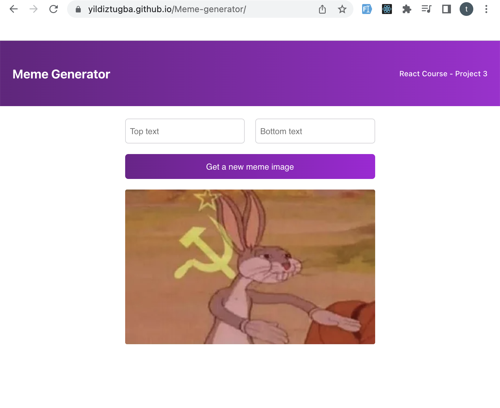

# React Project

## Meme Generator
I developed this project after I completed Section 3 of React course on Scrimba.

The aim is to create own meme with fun text and random images
## Deployment

[https://yildiztugba.github.io/Meme-generator](https://yildiztugba.github.io/Meme-generator)


## Overview


## Tools and Technologies

- React
  - State, setState
  - UseEffect
  - Props
  - Form
  - Input,Button
  - Component
  - onChange & onClick
  - Declarative methods

### Devops

- Github

## Setup

To run the app, type `npm start` in the CLI.

## Sample React code

Here is a look at how to set a random image to a state object.

```
function getMemeImage(){
           const randomNumber = Math.floor(Math.random()* allMeme.length)
           const randomImage = allMeme[randomNumber].url

            setMemeData(prevMeme=>({
                ...prevMeme,
                ["url"]: randomImage
            }))
            console.log(memeData)
        }

```